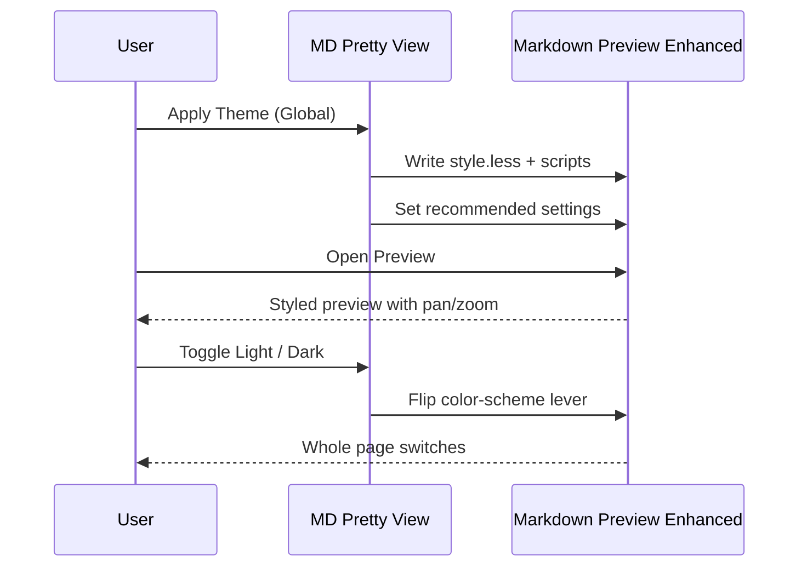
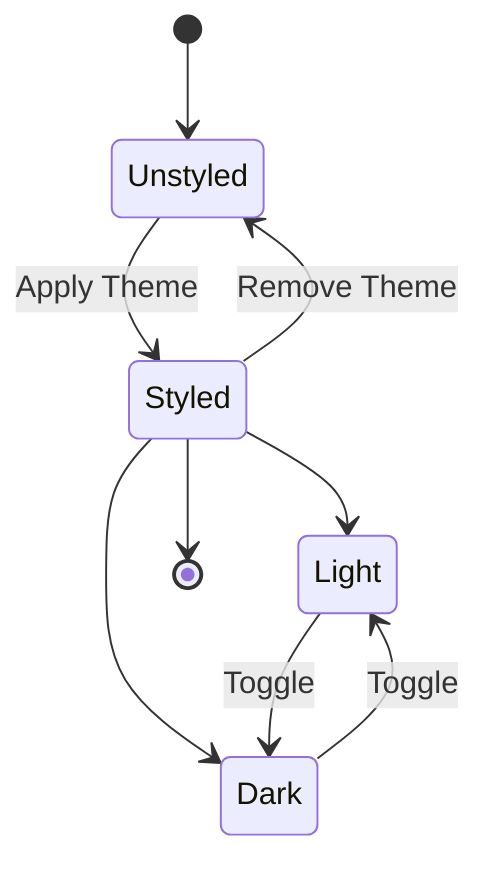

# MD Pretty View — Feature Showcase

> Open this file with **Markdown Preview Enhanced** (`⌘⇧V` / `Ctrl⇧V`, or open to the
> side with `⌘K V` / `Ctrl K V`) after running **MD Pretty View: Apply Theme (Global)**.
> Then run **MD Pretty View: Toggle Light / Dark** to see the whole page flip.

This page exercises every capability of the extension in one place — handy for a quick
visual check and for recording the demo GIFs.

---

## 1. Consistent syntax palette

The same editor-style palette is applied to every language, in both the live preview and
exported HTML, regardless of your VS Code theme.

### C#

```csharp
using System;
using System.Collections.Generic;
using System.Linq;

namespace PrettyView.Demo;

/// <summary>Represents a styled document.</summary>
public sealed record Document(string Title, IReadOnlyList<string> Tags)
{
    public bool IsTagged => Tags.Count > 0;

    public static Document Create(string title, params string[] tags)
    {
        ArgumentException.ThrowIfNullOrWhiteSpace(title);
        return new Document(title, tags.Distinct().ToArray());
    }
}
```

### TypeScript

```typescript
type Theme = "light" | "dark";

interface PreviewOptions {
  theme: Theme;
  panZoom: boolean;
}

const toggle = (t: Theme): Theme => (t === "light" ? "dark" : "light");

export function applyTheme({ theme, panZoom }: PreviewOptions): void {
  console.log(`Applying ${theme} theme (pan/zoom: ${panZoom})`);
}
```

### Python

```python
from dataclasses import dataclass, field


@dataclass
class Diagram:
    title: str
    nodes: list[str] = field(default_factory=list)

    def add(self, *names: str) -> "Diagram":
        self.nodes.extend(names)
        return self


d = Diagram("Flow").add("Start", "Process", "End")
print(f"{d.title}: {' -> '.join(d.nodes)}")
```

### Bash

```bash
#!/usr/bin/env bash
set -euo pipefail

for md in docs/*.md; do
  echo "Rendering ${md}..."
  npx @vscode/vsce package --no-dependencies
done
```

### JSON

```json
{
  "mdPrettyView.applyMpeSettings": true,
  "markdown-preview-enhanced.previewTheme": "none.css",
  "markdown-preview-enhanced.codeBlockTheme": "vscode.css"
}
```

### SQL

```sql
SELECT title, COUNT(*) AS tag_count
FROM documents d
JOIN tags t ON t.document_id = d.id
WHERE d.published = TRUE
GROUP BY title
HAVING COUNT(*) > 2
ORDER BY tag_count DESC;
```

---

## 2. Mermaid pan / zoom & fit-to-screen

Hover a diagram and use the controls: **drag** to pan, **⌘/Ctrl + scroll** (or the +/−
buttons) to zoom, **double-click** to reset, and **⛶** to fit the whole diagram to the
viewport (Esc to exit). Try it on the larger diagrams below.

### Sequence diagram



### State diagram



---

## 3. Math (KaTeX)

Inline math renders too: the toggle cost is $O(1)$ per switch.

$$
\text{contrast}(fg, bg) = \frac{L_{\max} + 0.05}{L_{\min} + 0.05}
$$

---

## 4. Horizontal rule & footnote

Above each numbered section is a horizontal rule (`---`). Footnotes work as well.[^1]

[^1]: Footnote text — check that it renders legibly in both light and dark modes.
