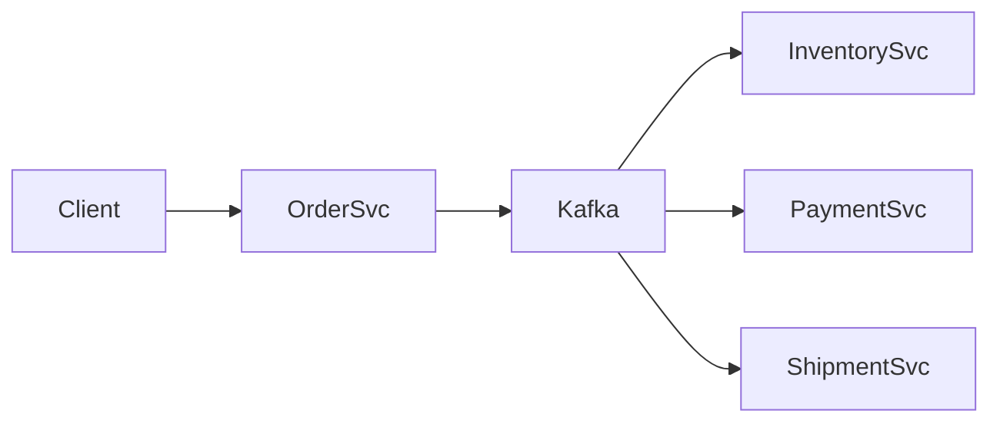

# Zoom + C# highlight test

## Mermaid (should have pan/zoom controls in the preview)



## C# code block (VS2019 palette)

```csharp
public sealed class OrderService
{
    private readonly IRepository<Order> _orders;

    public OrderService(IRepository<Order> orders) => _orders = orders;

    public async Task<Guid> PlaceAsync(Order order, CancellationToken ct = default)
    {
        // idempotent create
        await _orders.AddAsync(order, ct);
        return order.Id;
    }
}
```
