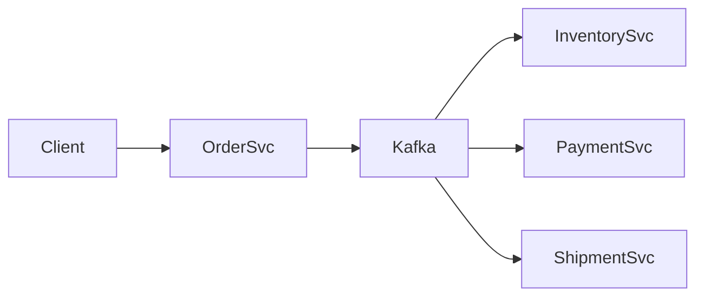

# Zoom + C# highlight test

## Mermaid (should have pan/zoom controls in the preview)



## C# code block (bundled palette)

```csharp
public sealed class OrderService
{
    private readonly IRepository<Order> _orders;

    public OrderService(IRepository<Order> orders) => _orders = orders;

    public async Task<Guid> PlaceAsync(Order order, CancellationToken ct = default)
    {
        // idempotent create
        await _orders.AddAsync(order, ct);
        return order.Id;
    }
}
```

## Python code block (should keep its own highlighter colors)

```python
from dataclasses import dataclass


@dataclass
class Order:
    id: str
    total: float

    def apply_discount(self, pct: float) -> float:
        # clamp to [0, 100]
        pct = max(0.0, min(100.0, pct))
        return self.total * (1 - pct / 100)
```

## JavaScript code block (should keep its own highlighter colors)

```javascript
export async function placeOrder(orders, order) {
  // idempotent create
  await orders.add(order);
  return order.id;
}
```
